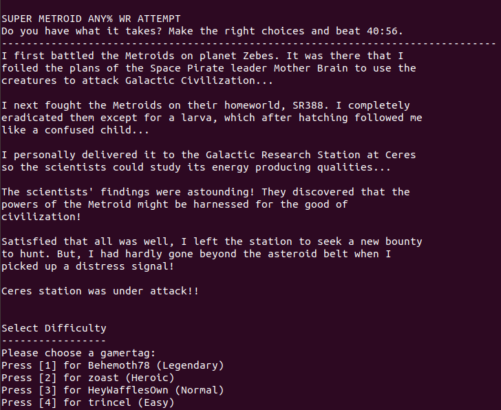
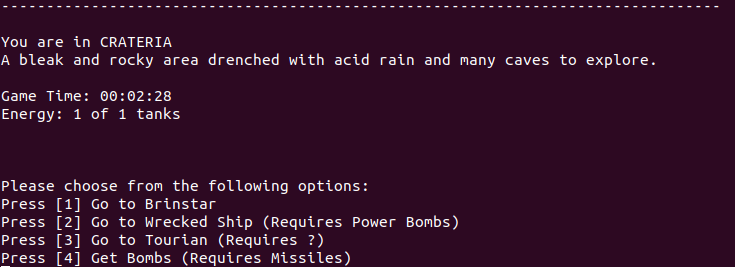

# Text-based WR Any% Super Metroid Speedrun



Can you make the right decisions to complete this text-based adventure as efficiently as ```Behemoth78``` did in his [2019 WR run](https://www.youtube.com/watch?v=7eIRE_j4Uds) of the SNES classic Super Metroid? This exercise in object-oriented design and C++ implementation was an original final project for Intro to CS II. It runs in your terminal. 

## Getting Started

Download files and build with ```make``` at the command line.

### Prerequisites

Linux, gcc 11+, GNU make.

### Run the game
```$ make```
```./FinalProject```

This will build and launch the game. From there, select your difficulty level, explore the map, and make your choices. Your "time" will accumulate based on the choices you make, backtracking, etc. To beat the WR time, you must follow the most efficent path, roll favorable outcomes on bosses (watch out for Phantoon), and maybe even sacrifice some extra energy tanks.  



## Authors

* **Trinity Lundgren** - [trinitylundgren](https://github.com/trinitylundgren)
